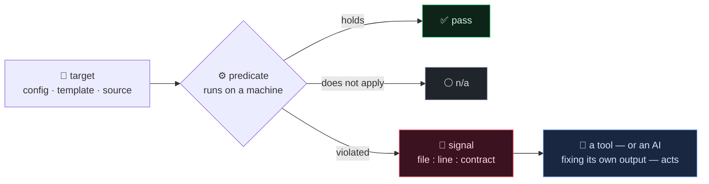
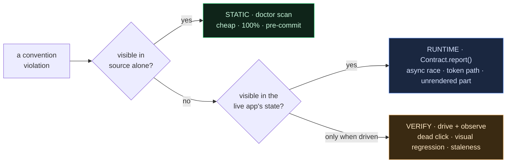
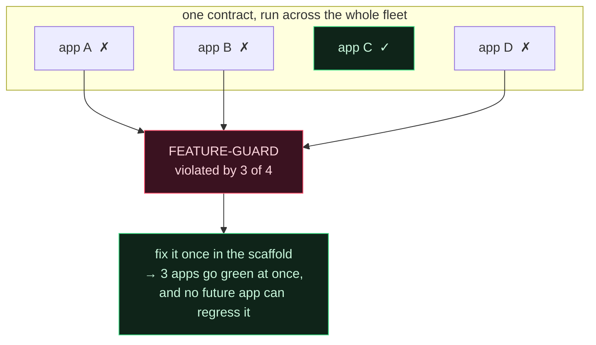
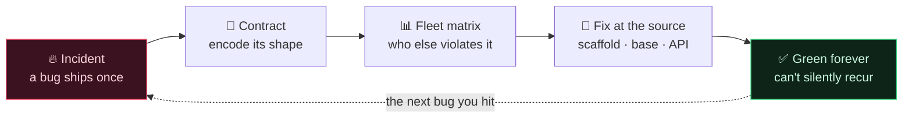
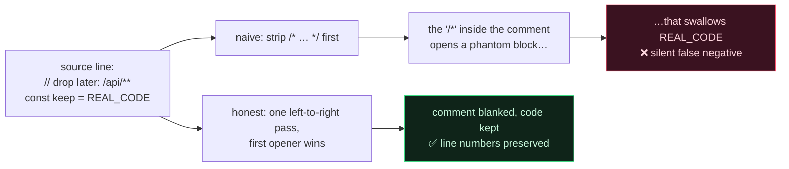

[🇺🇸 English](README.md) · [🇰🇷 한국어](README.ko.md) · [🇯🇵 日本語](README.ja.md) · [🇨🇳 简体中文](README.zh.md)

# Contract-Driven Scaffolding

**AI が書くコードを一行ずつレビューすることはできない。ならばレビューをやめ、すでに痛い目に遭ったバグの前で、プロジェクト自身に green を証明させればいい。**

> [**NSKit**](https://github.com/nskit-io/nskit-io) で稼働中 — *構造には縛られ、組み合わせは自由に。* NSKit の `doctor` を支える自己診断モデルであり、大半を LLM が書いた21 本のプロダクションアプリを、これでゲートしている。

> バグは一度起きる。次にやるべきは修正ではなく、そのバグの*形*を二度と成立させない検査を一つ書き、持っているすべてのプロジェクトに永久に回すことだ。

**Contract-Driven Scaffolding** は、生成されたコードを規模が大きくなっても正しく保つための設計パターンだ。依存ゼロのリファレンス実装が付いてくる。インストールして使うリンターではなく、**遭遇した個々のインシデントを機械が検査する契約に変え、その契約の*総体*を「まずソースのどこを直すべきか」の優先順位へと変える**考え方である。どんなスタックにもそのまま移植できる。

---

## 目次

- [問題 — フレームワーク最悪のバグはフレームワーク自身が生む](#問題--フレームワーク最悪のバグはフレームワーク自身が生む)
- [ありがちな対処がなぜ効かないのか](#ありがちな対処がなぜ効かないのか)
- [契約は4つの要素でできている](#契約は4つの要素でできている)
- [3-tier — static · runtime · verify](#3-tier--static--runtime--verify)
- [複利で回りだす仕掛け — 昇格マトリクス](#複利で回りだす仕掛け--昇格マトリクス)
- [本当に難しいところ — 素朴な grep は嘘をつく](#本当に難しいところ--素朴な-grep-は嘘をつく)
- [リファレンスコード](#リファレンスコード)
- [ESLint · Semgrep · Checkstyle と何が違うのか](#eslint--semgrep--checkstyle-と何が違うのか)
- [いつ使い、いつ使わないか](#いつ使いいつ使わないか)
- [リンク](#リンク)

---

## 問題 — フレームワーク最悪のバグはフレームワーク自身が生む

LLM にコードベースを渡すと、正しいコードを大量に、間違ったコードを少しだけ吐く。ただしその間違いはタイプミスの類ではない — それはコンパイラが拾う。厄介なのは、*一見まともなのに*、自分たちのプロジェクトにしか存在しない規約を破ったコードのほうだ。

- モバイルのフルスクリーンダイアログを戻るボタンで閉じたいのに、そもそもフレームワークが戻る操作を履歴に結びつけていないため、戻るとアプリごと抜けてしまう。
- サブページは当然スクロールするはずが、あるユーティリティクラスが `display:block` を当て、スクロールが依存していた flex レイアウトを音もなく上書きする。
- 管理画面の JavaScript が静かに壊れる。`[[ 配列 ]]` リテラルがテンプレートエンジンの `[[${…}]]` 構文と衝突したせいだが、ソースは構文チェックを平然と通ってしまう。

どれ一つドメインのバグではない。すべては**自分たちが作った抽象が取り立てにくる税**だ。規約を一つ作るたび、それは誰かが — あるいは何らかのモデルが — 永遠に覚えて守り続けねばならない規約になる。人間のレビューは AI が吐く量に追いつかず、「よくあるミス」の Wiki は一度読まれて忘れられる。結局その知識は一人の頭の中だけに残り、その一人がバスファクターになる。

## ありがちな対処がなぜ効かないのか

**「よくあるミス」ドキュメント。** 立派な組織の記憶だが、死んでいる。ビルドを止められない。何も*検査しない*から、新しいプロジェクトのたびに同じバグを一から稼ぎ直すことになる。

**人間によるコードレビュー。** 正しい。ただし毎分モジュールを一本吐くモデルの速度には勝てない。レビュアーは慣れてしまい、微妙な規約の十件目はそのまま通る。

**汎用の静的解析**（ESLint, Semgrep, Checkstyle）。*普遍的な*アンチパターンには強い。だが*自分たちの*ものには盲目だ。このフレームワークで `.show{display:block}` がサブページを壊す、などと知っている既製ルールは存在しようがない — それは自分たちがそう作ったから生まれた事実なのだから。

これらの再発バグは、結局ひとつの文に凝縮される。

> **フレームワークが契約を保証せず、ビルダーが正しく書いてくれることを信じている。**

契約は、その「信頼」を自動検査に変える。そしてビルダーが AI になった瞬間、その信頼こそが、こちらが決して差し出せないものになる — だから信じる代わりにコードへ埋め込む。

## 契約は4つの要素でできている

```
契約 = (対象, 検査タイミング, 判定式, 違反シグナル)
```

- **対象** — 何を見るか。config、テンプレート、properties、ソースツリー。
- **検査タイミング** — もっとも早く捕まえられる tier（下記）。
- **判定式** — 人間のレビューではなく*機械*が回す。成立 / 違反 / 対象外 のいずれか。
- **違反シグナル** — 必ず機械可読。`file:line:contract` の形だ。別のツールが、あるいは自分の出力を直す AI が、これをパースして即座に動く。人間向けのレポートはその上に載せたおまけにすぎない。



規律はひとつ。**それを保証する契約なしに、フレームワークへプリミティブを新しく足さない。** 契約こそが自己診断だ。

## 3-tier — static · runtime · verify

バグは、それぞれ捕まえられる中でもっとも早く安い tier で捕まえる。



tier が違っても、契約の形は同じ4要素だ。変わるのはコストとタイミングだけ。

```
STATIC (ビルド/リント)      RUNTIME (自己状態の申告)        VERIFY (closed-loop)
ソースだけで判定            アプリが生きている間に自ら assert  変更直後に実際に動かして観察
= doctor scan             = Contract.report()            = playwright / probes
安い·100%·プリコミット       中間·「なぜ描画されなかったか」     高い·デッドクリック·視覚回帰·鮮度
```

負債とドリフトの大半は **static** tier で死ぬ。この repo のリファレンス実装がまさにその tier だ。runtime・verify tier は、ソースからは見えないバグ（async レース、トークン refresh 経路、描画されないパート、デッドクリック）のために存在し、形は同じ — 機械の判定式、機械可読なシグナル。

## 複利で回りだす仕掛け — 昇格マトリクス

一つのプロジェクトに pass/fail を返すだけなら、ただのリンターだ。ところが*同じ*契約を fleet 全体に回すと、それより価値のあるものが落ちてくる。



*もっとも多く*のプロジェクトが引っかかる契約こそ、**ソースで直す価値がもっとも大きい抽象**だ。スキャフォールドで、base テンプレートで、フレームワーク API で直しておけば、二度と再発しない。マトリクスは**爆発半径の順に並んだ昇格バックログ**であり、各プロジェクトをゲートしていたまさにその検査からそのまま落ちてくる。いまやリンターが「自分の作った規約のうち、次にどれを直すべきか」まで指してくれる。汎用ツールにこれはできない — その規約がそもそも自分のものだと知らないからだ。



これがフライホイールだ。**インシデント → 契約 → fleet マトリクス → ソースで修正 → 永久に green。** 一周回るたびに、次のプロジェクトは少しずつ壊しにくくなる。痛い目に遭ったバグの一つひとつが、未来のすべてのプロジェクトを少しずつ頑丈にする。

## 本当に難しいところ — 素朴な grep は嘘をつく

契約リンターは、look-alike に*発火しない*節度のぶんだけしか信頼されない。一度でも狼少年になった瞬間、人は読むのをやめ、誰も信じないゲートはないほうがマシになる。高い授業料で学んだ教訓が三つ、リファレンスエンジンに埋め込まれている。

**1. コメントはコードではない。** コメント内の禁止トークンは違反ではない。ところがブロックコメントを行コメントより先に blank 処理すると、幽霊バグが生まれる。`// あとで削除: /api/**` のような行には `/*` という部分文字列が潜んでおり、次の `*/` まで本物のコードを丸呑みするブロックコメントを開いてしまう。解は左→右の単一 alternation — 先に開いたコメントが勝つ — 言語の lexer が見る通りに。（[`core.py`](src/contracts/core.py) の `blank_comments`。）



**2. 同じ文字でも、場所が違えば意味が違う。** テンプレート内の `[[${user}]]` は正当なサーバ式だが、`[[ 'a', 1 ], … ]` はテンプレートエンジンが静かに壊す JavaScript の配列の配列だ。契約は後者に発火し、前者には決して発火してはならない。

**3. 文脈は隣の行にある。** `useAuth: false` は乱用だ — *ただし*、二行下の呼び出しが auth を飛ばしてよいトークン発行エンドポイントなら話は別だ。実際のオブジェクトリテラルでは両者が別々の行に置かれるため、一行しか見ない grep は例外を誤検知するか、乱用を取りこぼす。エンジンは判定に必要な文脈を見られるよう `±N 行のウィンドウ` を用意している。

だからこのパターンは「正規表現をいくつか」以上のものだ。これを正しくやれるかどうかが、人が信じるゲートと、ミュートされるゲートを分ける。

## リファレンスコード

[`src/`](src/) に依存ゼロの Python — 約 200 行のエンジンと、それぞれ実際の現場インシデントから蒸留したスターター契約ライブラリだ。契約は `Project` を受け取る小さな関数にすぎない。

```python
from src.contracts import contract, Project, Result, Severity, verdict

@contract(id="NO-DEBUG-MARKER", section="incident-log#debug-markers",
          severity=Severity.MED,
          describe="No DEBUG_ONLY marker survives into shipped source")
def no_debug_marker(p: Project) -> Result:
    hits = p.grep(r"\bDEBUG_ONLY\b", exts=(".js", ".java", ".py"))  # コメントは自動で除外
    return verdict(hits, "no live DEBUG_ONLY markers",
                   "DEBUG_ONLY in shipped source ({n})")
```

worked example を実行 — fixture プロジェクト二つ（一方は green、もう一方は契約 5 件に引っかかるよう仕込んだもの）、そして fleet マトリクスと昇格バックログ:

```bash
python examples/demo.py
python -m pytest test/          # 「素朴な grep は嘘をつく」ケースがテストとして刻まれている
```

任意のプロジェクトをスキャン・ゲート（JSON が機械向けの契約、きれいなレポートはおまけ）:

```bash
python -m src.doctor scan   ./my-project --json
python -m src.doctor matrix ./all-my-projects
```

## ESLint · Semgrep · Checkstyle と何が違うのか

それらは*普遍的な*ルールにぴったりの道具で、当然使うべきだ。このパターンは三つの軸でそれらと直交する。

- **言語ではなく自分の抽象を狙う。** 契約が包むのは、*自分たちの*フレームワークがそう動くから生まれたバグだ。「このプロジェクト固有の規約」に対するコミュニティのルールセットなど存在しない。
- **マトリクスが一級の成果物だ。** 目的はプロジェクトをゲートして終わりではなく、*自分の*負債を爆発半径で並べ、スキャフォールドへ修正を押し込むところまで届く。リント工程ではなく、フレームワークを進化させる契機だ。
- **契約は tier をまたぐ。** ソースから見えないもの（async レンダーレース、履歴の不均衡）は、同じ4要素の形のまま runtime・verify tier に置かれる。リントの一段階ではなく、ライフサイクル全体を貫く整合性モデルだ。

ルールが普遍的なら Semgrep を取れ。ルールが*自分が*何かを特定のやり方で作ったから存在するなら、それは契約だ。

## いつ使い、いつ使わないか

- **使うとき** — コードのかなりの部分が生成され（AI でもスキャフォールドでも codegen でも）、汎用リンターが知りようのない規約がフレームワークにあるとき。とりわけマトリクスが真価を発揮する複数プロジェクト環境で。
- **使うとき** — 同じ種類のバグに二度やられたとき。二度目が「直すのではなく契約を書け」の合図だ。
- **使わないとき** — 小さなアプリ一本に、全行を追うレビュアーがいるとき。契約を形式化するオーバーヘッドは、fleet 規模か生成量でしか元が取れない。
- **過適合するな。** look-alike に発火する契約は、人を「無視するよう」訓練してしまう。正直に作れないなら（[本当に難しいところ](#本当に難しいところ--素朴な-grep-は嘘をつく)を参照）、作れるようになるまでは「よくあるミス」ドキュメントに残しておけ。

## リンク

- [**NSKit**](https://github.com/nskit-io/nskit-io) — このパターンが実際に動いているフレームワーク
- [**ai-native-design**](https://github.com/nskit-io/ai-native-design) — AI を著者に据えて設計するという思想
- 制作 [Neoulsoft Inc.](https://neoulsoft.com) — ソウル、2019 年設立

## ライセンス

MIT © Neoulsoft Inc. [LICENSE](LICENSE) を参照。
