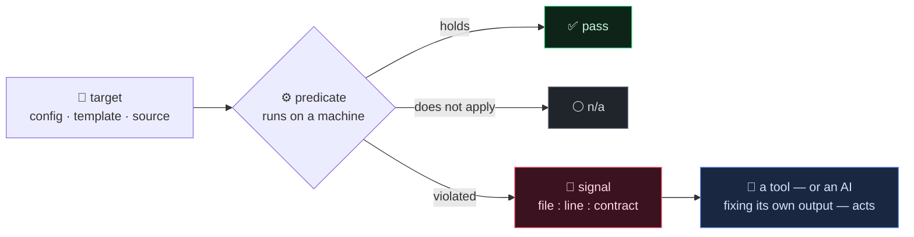
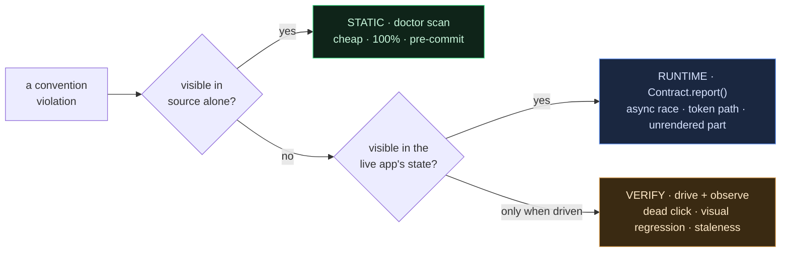
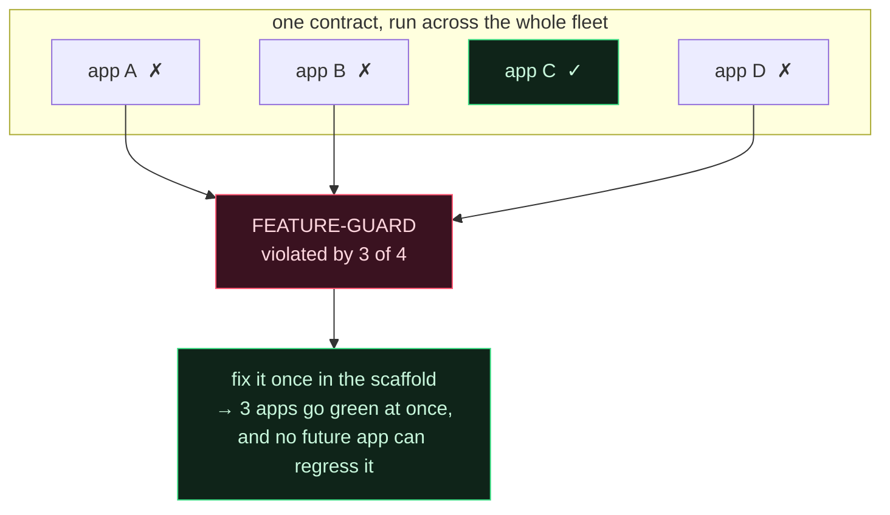
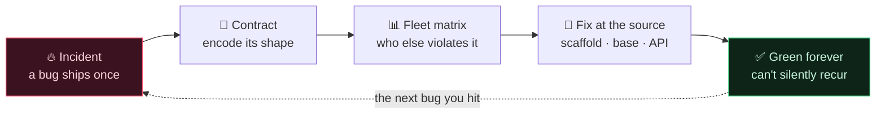
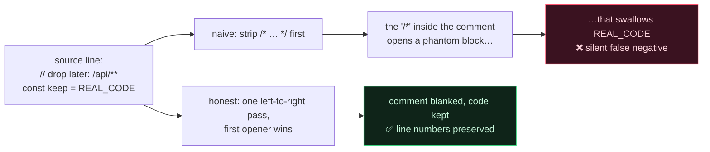

[🇺🇸 English](README.md) · [🇰🇷 한국어](README.ko.md) · [🇯🇵 日本語](README.ja.md) · [🇨🇳 简体中文](README.zh.md)

# Contract-Driven Scaffolding

**AI가 쏟아내는 코드를 한 줄씩 리뷰할 순 없다. 그러니 리뷰를 붙잡는 대신, 이미 크게 데어 본 버그들 앞에서 프로젝트가 스스로 green을 증명하게 만든다.**

> [**NSKit**](https://github.com/nskit-io/nskit-io) 에서 사용 중 — *구조에는 묶이되, 조합은 자유롭게.* NSKit `doctor` 를 떠받치는 자가진단 모델이며, 대부분 LLM이 짠 ~30개 프로덕션 앱을 이걸로 게이트한다.

> 버그는 한 번 터진다. 그다음 할 일은 고치는 게 아니라, 그 버그의 *형태*를 다시는 성립할 수 없게 만드는 검사 하나를 짜고 — 가진 모든 프로젝트에 영원히 돌리는 것이다.

**Contract-Driven Scaffolding** 은 생성된 코드를 규모가 커져도 옳게 유지하기 위한 설계 패턴이다. 의존성 없는 레퍼런스 구현이 함께 온다. 설치해서 쓰는 린터가 아니라, **겪은 사건 하나하나를 기계가 검사하는 계약으로 바꾸고, 그 계약들의 *총합*을 "무엇을 소스에서 먼저 고쳐야 하는가"의 우선순위로 바꾸는** 사고방식이다. 어느 스택에든 그대로 옮겨 심으면 된다.

---

## 목차

- [문제: 프레임워크의 가장 나쁜 버그는 프레임워크가 스스로 만든다](#문제-프레임워크의-가장-나쁜-버그는-프레임워크가-스스로-만든다)
- [흔한 처방들이 왜 듣지 않는가](#흔한-처방들이-왜-듣지-않는가)
- [계약은 네 가지로 이루어진다](#계약은-네-가지로-이루어진다)
- [3-tier: static · runtime · verify](#3-tier-static--runtime--verify)
- [복리로 굴러가게 만드는 반전 — 승격 매트릭스](#복리로-굴러가게-만드는-반전--승격-매트릭스)
- [진짜 어려운 대목 — 순진한 grep은 거짓말을 한다](#진짜-어려운-대목--순진한-grep은-거짓말을-한다)
- [레퍼런스 코드](#레퍼런스-코드)
- [ESLint · Semgrep · Checkstyle 과는 무엇이 다른가](#eslint--semgrep--checkstyle-과는-무엇이-다른가)
- [언제 쓰고, 언제 쓰지 말아야 하는가](#언제-쓰고-언제-쓰지-말아야-하는가)
- [링크](#링크)

---

## 문제: 프레임워크의 가장 나쁜 버그는 프레임워크가 스스로 만든다

LLM에 코드베이스를 물려주면 맞는 코드를 잔뜩, 틀린 코드를 조금 뱉는다. 그런데 틀린 코드는 오타 같은 게 아니다 — 그건 컴파일러가 알아서 잡는다. 골치 아픈 건 *멀쩡해 보이는데* 우리 프로젝트에만 존재하는 규칙을 어긴 코드다.

- 모바일 풀스크린 다이얼로그를 뒤로가기로 닫으려는데, 정작 프레임워크가 back을 히스토리에 물려둔 적이 없어서 뒤로가기가 앱을 통째로 빠져나간다.
- 서브페이지가 당연히 스크롤돼야 하는데, 유틸 클래스 하나가 `display:block` 을 걸어 스크롤이 기대던 flex 레이아웃을 소리 없이 덮어버린다.
- 어드민 페이지의 자바스크립트가 조용히 깨진다. `[[ 배열 ]]` 리터럴이 템플릿 엔진의 `[[${…}]]` 문법과 충돌한 탓인데, 소스는 문법 검사를 멀쩡히 통과한다.

셋 중 어느 것도 도메인 버그가 아니다. 전부 **우리가 만든 추상화가 물어오는 세금**이다. 규칙을 하나 만들 때마다, 그건 누군가가 — 혹은 어떤 모델이 — 영원히 기억하고 지켜야 할 규칙이 된다. 사람 리뷰는 AI가 찍어내는 양을 절대 못 따라가고, "이런 실수 조심" 위키는 딱 한 번 읽히고 잊힌다. 결국 그 지식은 한 사람 머릿속에만 남고, 그 사람이 곧 버스 팩터가 된다.

## 흔한 처방들이 왜 듣지 않는가

**"자주 하는 실수" 문서.** 훌륭한 제도적 기억이지만, 죽어 있다. 빌드를 세우지 못한다. 아무것도 *검사하지 않으니*, 새 프로젝트마다 같은 버그를 처음부터 다시 벌어야 한다.

**사람 코드리뷰.** 옳다. 다만 1분에 모듈 하나씩 찍어내는 모델의 속도를 못 당한다. 리뷰어는 익숙해지고, 미묘한 규칙의 열 번째 사례쯤은 그냥 통과한다.

**범용 정적분석**(ESLint, Semgrep, Checkstyle). *보편적인* 안티패턴에는 강하다. 그런데 *우리 것*에는 눈이 없다. 우리 프레임워크에서 `.show{display:block}` 이 서브페이지를 깬다는 사실을 아는 기성 룰은 존재할 수가 없다 — 그건 우리가 그렇게 만들어서 생긴 사실이니까.

이 재발 버그들은 결국 한 문장으로 압축된다.

> **프레임워크가 계약을 보증하지 않고, 빌더가 알아서 맞게 짜 주기를 믿는다.**

계약은 그 "믿음"을 자동 검사로 바꾼다. 그리고 빌더가 AI가 된 순간, 그 믿음이야말로 우리가 도저히 내어줄 수 없는 것이 된다 — 그러니 믿는 대신 코드로 박아 둔다.

## 계약은 네 가지로 이루어진다

```
계약 = (대상, 검사 시점, 판정식, 위반 신호)
```

- **대상** — 무엇을 들여다보는가. config, 템플릿, properties, 소스 트리.
- **검사 시점** — 가장 이르게 잡아낼 수 있는 tier(아래).
- **판정식** — 사람 리뷰가 아니라 *기계*가 돌린다. 성립 / 위반 / 해당 없음, 셋 중 하나.
- **위반 신호** — 반드시 머신리더블. `file:line:contract` 형태다. 다른 도구가, 혹은 자기 출력을 고치는 AI가 이걸 파싱해 곧장 행동한다. 사람이 읽는 리포트는 그 위에 얹은 덤이다.



규율은 하나다. **그걸 보증하는 계약 없이는 프레임워크에 프리미티브를 새로 넣지 않는다.** 계약이 곧 자가진단이다.

## 3-tier: static · runtime · verify

버그는 저마다 잡아낼 수 있는 가장 이르고 가장 싼 tier에서 잡는다.



tier가 달라도 계약의 형태는 똑같은 네 가지다. 바뀌는 건 비용과 시점뿐이다.

```
STATIC (빌드/린트)          RUNTIME (자기 상태 서술)         VERIFY (closed-loop)
소스만 봐도 판정             앱이 살아 있을 때 스스로 assert    바꾼 직후 실제로 구동해 관찰
= doctor scan              = Contract.report()            = playwright / probes
싸다·100%·프리커밋           중간·"왜 안 그려졌나"            비싸다·데드클릭·시각 회귀·신선도
```

부채와 드리프트는 대부분 **static** tier에서 죽는다. 이 repo의 레퍼런스 구현이 바로 그 tier다. runtime·verify tier는 소스로는 안 보이는 버그(async 레이스, 토큰 refresh 경로, 안 그려진 파트, 데드클릭)를 위해 존재하며, 형태는 똑같다 — 기계 판정식, 머신리더블 신호.

## 복리로 굴러가게 만드는 반전 — 승격 매트릭스

한 프로젝트에 pass/fail만 찍어 주는 건 그냥 린터다. 그런데 *똑같은* 계약을 fleet 전체에 돌리면, 그보다 값진 게 딸려 나온다.



*가장 많은* 프로젝트가 걸리는 계약이 곧 **소스에서 고칠 가치가 가장 큰 추상화**다. 스캐폴드에서, base 템플릿에서, 프레임워크 API에서 고쳐 두면 두 번 다시 재발하지 않는다. 매트릭스는 **폭발 반경 순으로 정렬된 승격 백로그**이고, 각 프로젝트를 게이트하던 바로 그 검사에서 그대로 떨어져 나온다. 이제 린터가 "네가 만든 규칙 중 다음에 뭘 고쳐야 하는지"까지 짚어 준다. 범용 도구는 이걸 못 한다 — 그 규칙이 애초에 네 것이라는 걸 모르기 때문이다.



이게 플라이휠이다. **사건 → 계약 → fleet 매트릭스 → 소스에서 수정 → 영원히 green.** 한 바퀴 돌 때마다 다음 프로젝트는 조금씩 더 깨기 어려워진다. 크게 데어 본 버그 하나하나가 미래의 모든 프로젝트를 조금씩 더 단단하게 만든다.

## 진짜 어려운 대목 — 순진한 grep은 거짓말을 한다

계약 린터는 look-alike에 *안 터지려는* 절제만큼만 신뢰받는다. 한 번이라도 늑대야 외치는 순간 사람들은 읽기를 그만두고, 아무도 안 믿는 게이트는 아예 없느니만 못하다. 비싸게 배운 교훈 셋이 레퍼런스 엔진에 박혀 있다.

**1. 주석은 코드가 아니다.** 주석 속 금지 토큰은 위반이 아니다. 그런데 블록 주석을 라인 주석보다 먼저 blank 처리하면 유령 버그가 생긴다. `// 나중에 삭제: /api/**` 같은 줄에는 `/*` 부분 문자열이 들어 있어, 다음 `*/` 까지 진짜 코드를 통째로 삼키는 블록 주석이 열려 버린다. 해법은 좌→우 단일 alternation — 먼저 열린 주석이 이긴다 — 언어 lexer가 보는 방식 그대로다. ([`core.py`](src/contracts/core.py)의 `blank_comments`.)



**2. 같은 글자가 자리에 따라 뜻이 다르다.** 템플릿 안의 `[[${user}]]` 는 정당한 서버 표현식이지만, `[[ 'a', 1 ], … ]` 는 템플릿 엔진이 소리 없이 뭉개 버리는 자바스크립트 배열의 배열이다. 계약은 후자에는 터지고 전자에는 결코 터지지 않아야 한다.

**3. 맥락은 옆줄에 있다.** `useAuth: false` 는 남용이다 — *단*, 두 줄 아래 호출이 auth를 건너뛰어도 되는 토큰 발급 엔드포인트라면 얘기가 다르다. 실제 객체 리터럴에서는 이 둘이 서로 다른 줄에 놓이기 때문에, 한 줄만 보는 grep은 예외를 오탐하거나 남용을 놓친다. 엔진은 판정에 필요한 맥락을 볼 수 있도록 `±N줄 윈도우` 를 제공한다.

이래서 이 패턴은 "정규식 몇 개" 이상이다. 이걸 제대로 하느냐가 사람이 믿는 게이트와 음소거해 버리는 게이트를 가른다.

## 레퍼런스 코드

[`src/`](src/) 안에 의존성 없는 Python — ~200줄짜리 엔진과, 각각 실제 현장 사건에서 증류한 스타터 계약 라이브러리다. 계약은 `Project` 하나를 받는 작은 함수다.

```python
from src.contracts import contract, Project, Result, Severity, verdict

@contract(id="NO-DEBUG-MARKER", section="incident-log#debug-markers",
          severity=Severity.MED,
          describe="No DEBUG_ONLY marker survives into shipped source")
def no_debug_marker(p: Project) -> Result:
    hits = p.grep(r"\bDEBUG_ONLY\b", exts=(".js", ".java", ".py"))  # 주석은 자동 제외
    return verdict(hits, "no live DEBUG_ONLY markers",
                   "DEBUG_ONLY in shipped source ({n})")
```

worked example 실행 — fixture 프로젝트 둘(하나는 green, 하나는 계약 5개를 걸리게 짜 둔 것), 그리고 fleet 매트릭스와 승격 백로그:

```bash
python examples/demo.py
python -m pytest test/          # "순진한 grep은 거짓말을 한다" 케이스들이 테스트로 박제돼 있다
```

아무 프로젝트나 스캔·게이트 (JSON이 기계용 계약, 예쁜 리포트는 덤):

```bash
python -m src.doctor scan   ./my-project --json
python -m src.doctor matrix ./all-my-projects
```

## ESLint · Semgrep · Checkstyle 과는 무엇이 다른가

그 도구들은 *보편적인* 룰에 딱 맞고, 당연히 써야 한다. 이 패턴은 세 축에서 그것들과 직교한다.

- **언어가 아니라 네 추상화를 겨눈다.** 계약이 담는 건 *네* 프레임워크가 그런 식으로 동작하기 때문에만 존재하는 버그다. "이 프로젝트만의 규칙"에 대한 커뮤니티 룰셋 같은 건 없다.
- **매트릭스가 일급 산출물이다.** 목적은 프로젝트를 게이트하는 데서 끝나지 않고, *네* 부채를 폭발 반경으로 줄 세워 스캐폴드에 수정을 밀어 넣는 데까지 간다. 린트 단계가 아니라 프레임워크를 진화시키는 계기다.
- **계약은 tier를 가로지른다.** 소스로는 안 보이는 것(async 렌더 레이스, 히스토리 불균형)은 똑같은 4요소 형태 그대로 runtime·verify tier에 놓인다. 린트 한 단계가 아니라, 라이프사이클 전체를 아우르는 정합성 모델이다.

룰이 보편적이면 Semgrep을 집어라. 룰이 *네가* 무언가를 특정한 방식으로 만들어서 생긴 것이면, 그건 계약이다.

## 언제 쓰고, 언제 쓰지 말아야 하는가

- **쓸 때** — 코드 상당 부분이 생성되고(AI든 스캐폴드든 codegen이든), 프레임워크에 범용 린터가 알 리 없는 규칙이 있을 때. 특히 매트릭스가 제값을 하는 다중 프로젝트 환경에서.
- **쓸 때** — 같은 부류의 버그에 두 번 데었을 때. 두 번째가 곧 "고치지 말고 계약을 짜라"는 신호다.
- **쓰지 말 때** — 작은 앱 하나에 모든 줄을 훑는 리뷰어가 있을 때. 계약을 형식화하는 오버헤드는 fleet 규모나 생성량에서만 회수된다.
- **과적합 금지.** look-alike에 터지는 계약은 사람을 "무시하도록" 길들인다. 정직하게 못 만들겠으면([진짜 어려운 대목](#진짜-어려운-대목--순진한-grep은-거짓말을-한다) 참고), 만들 수 있을 때까지는 "자주 하는 실수" 문서에 그냥 남겨 둬라.

## 링크

- [**NSKit**](https://github.com/nskit-io/nskit-io) — 이 패턴이 실제로 돌아가는 프레임워크
- [**ai-native-design**](https://github.com/nskit-io/ai-native-design) — AI를 저자로 두고 설계한다는 철학
- 제작 [Neoulsoft Inc.](https://neoulsoft.com) — 서울, 2019 설립

## 라이선스

MIT © Neoulsoft Inc. [LICENSE](LICENSE) 참조.
