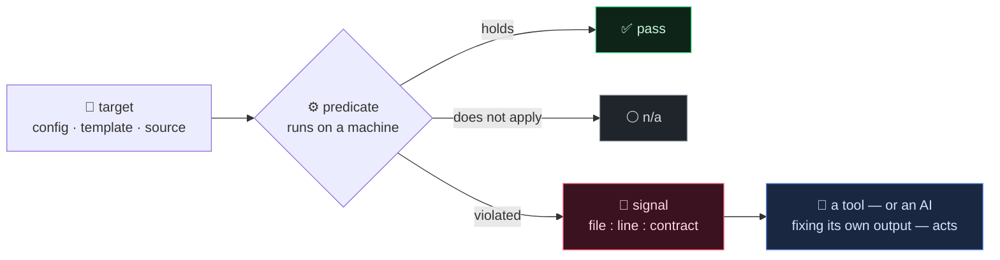
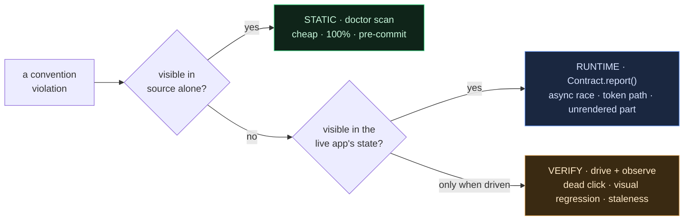
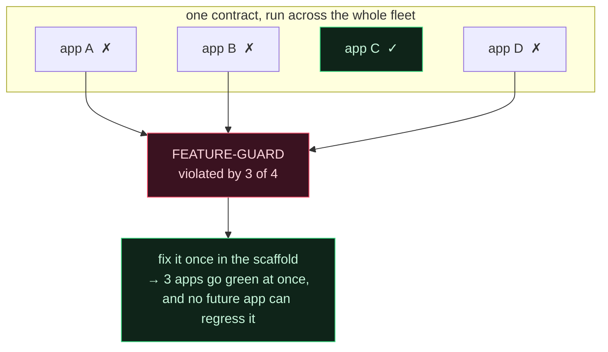
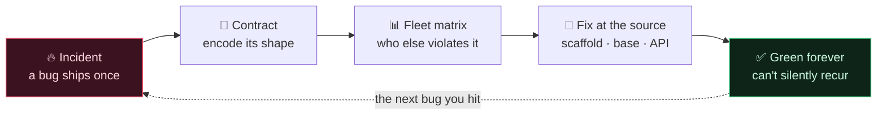
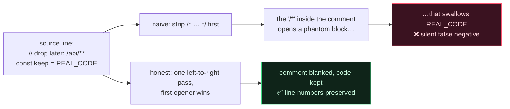

[🇺🇸 English](README.md) · [🇰🇷 한국어](README.ko.md)

# Contract-Driven Scaffolding

**AI가 쓴 코드를 한 줄 한 줄 리뷰할 순 없다. 그러니 리뷰를 멈추고 — 이미 데인 버그들에 대고 프로젝트가 스스로 green을 증명하게 하라.**

> [**NSKit**](https://github.com/nskit-io/nskit-io) 이 사용 — *구조에 묶이되, 조합은 자유롭게.* 이것은 NSKit `doctor` 뒤에 있는 자가진단 모델로, 대부분 LLM이 작성한 ~30개 프로덕션 앱을 게이트한다.

> 버그는 한 번 난다. 그다음 너는 그 버그의 *형태*를 불가능하게 만드는 검사를 짜고 — 소유한 모든 것에, 영원히, 그 검사를 돌린다.

**Contract-Driven Scaffolding** 은 생성된 코드를 규모 있게 옳게 유지하기 위한 설계 패턴이며, 의존성 없는 레퍼런스 구현이 딸려 있다. 설치하는 린터가 아니라, **모든 사건(incident)을 기계검증 계약으로 바꾸고, 그 계약들의 *집합*을 "소스에서 무엇을 고칠지"의 우선순위 백로그로 바꾸는** 방식이다. 어떤 스택에든 이식하라.

---

## 목차

- [문제: 프레임워크의 최악의 버그는 자기 자신이 만든다](#문제-프레임워크의-최악의-버그는-자기-자신이-만든다)
- [흔한 답들이 왜 안 되는가](#흔한-답들이-왜-안-되는가)
- [계약은 네 가지다](#계약은-네-가지다)
- [3-tier: static · runtime · verify](#3-tier-static--runtime--verify)
- [복리로 만드는 반전: 승격 매트릭스](#복리로-만드는-반전-승격-매트릭스)
- [어려운 부분: 순진한 grep은 거짓말한다](#어려운-부분-순진한-grep은-거짓말한다)
- [레퍼런스 코드](#레퍼런스-코드)
- [ESLint / Semgrep / Checkstyle 과 무엇이 다른가](#eslint--semgrep--checkstyle-과-무엇이-다른가)
- [언제 쓰고 언제 쓰지 말 것인가](#언제-쓰고-언제-쓰지-말-것인가)
- [링크](#링크)

---

## 문제: 프레임워크의 최악의 버그는 자기 자신이 만든다

LLM에게 코드베이스를 주면 대부분 맞는 코드를, 일부 틀린 코드를 짠다. 틀린 코드는 오타가 아니다 — 그건 컴파일러가 잡는다. 문제는 *맞아 보이는데* 너의 프로젝트에만 있는 컨벤션을 어기는 코드다:

- 모바일 풀스크린 다이얼로그를 뒤로가기로 닫으려는데 — 프레임워크가 back을 history에 연결한 적이 없어서 뒤로가기가 앱을 통째로 이탈시킨다;
- 서브페이지가 스크롤돼야 하는데 — 유틸 클래스 하나가 `display:block`을 걸어, 스크롤이 의존하는 flex 레이아웃을 조용히 덮어버린다;
- 어드민 페이지의 JS가 조용히 깨진다 — `[[ array ]]` 리터럴이 템플릿 엔진의 `[[${…}]]` 문법과 충돌했는데, 소스는 모든 문법검사를 통과했기 때문에.

이 중 어느 것도 도메인 버그가 아니다. 전부 **네 자신의 추상화가 물리는 세금**이다 — 네가 만든 모든 컨벤션은 누군가(혹은 어떤 모델)가 영원히 기억해서 지켜야 하는 컨벤션이다. 사람 리뷰는 AI가 뽑아내는 양을 못 따라가고, "함정 모음" 위키는 한 번 읽히고 잊힌다. 지식은 한 사람 머릿속에 있고, 그 사람이 곧 bus factor다.

## 흔한 답들이 왜 안 되는가

**"자주 하는 실수" 문서.** 진짜 제도적 기억이지만 — 죽어 있다. 빌드를 fail시킬 수 없다. 아무것도 *검사*하지 않으니 새 프로젝트마다 같은 버그를 다시 번다.

**사람 코드리뷰.** 옳지만, 분당 모듈 하나를 뽑는 모델의 출력을 못 따라간다. 리뷰어는 습관화되고, 미묘한 컨벤션의 열 번째 사례는 통과한다.

**범용 정적분석**(ESLint, Semgrep, Checkstyle). *보편적* 안티패턴엔 훌륭하다. *너의 것*엔 장님이다 — 너의 프레임워크에서 `.show{display:block}`이 서브페이지를 깬다는 걸 아는 기성 룰은 없다. 그 사실은 네가 그렇게 만들었기 때문에만 존재하니까.

이 재발 버그들은 전부 한 문장으로 환원된다:

> **프레임워크가 계약을 보증하지 않고, 빌더가 맞게 짜기를 믿는다.**

계약은 그 믿음을 자동 검사로 바꾼다. "빌더"가 AI일 때, 그 믿음은 네가 결코 줄 수 없는 바로 그것이다 — 그러니 대신 코드로 박아넣는다.

## 계약은 네 가지다

```
계약 = (대상, 검사 시점, 판정식, 위반 신호)
```

- **대상** — 무엇을 보는가: config, 템플릿, properties, 소스 트리.
- **검사 시점** — 가장 이르게 잡을 수 있는 tier(아래).
- **판정식** — *기계*가 돌린다, 사람 리뷰가 아니라. 성립 / 위반 / 해당없음.
- **위반 신호** — 머신리더블: `file:line:contract`. 다른 툴이 — 혹은 자기 출력을 고치는 AI가 — 파싱해서 행동한다. 사람용 리포트는 그 위에 얹은 친절일 뿐.



규율은 이렇다: **계약 없이는 프레임워크에 프리미티브를 추가하지 않는다.** 계약이 곧 자가진단이다.

## 3-tier: static · runtime · verify

각 버그를 잡을 수 있는 가장 이르고 싼 tier에서 잡는다.



모든 tier에서 형태는 같은 4-요소, 바뀌는 건 비용과 시점뿐:

```
STATIC (빌드/린트)          RUNTIME (자기서술)              VERIFY (closed-loop)
소스만 봐도 판정             살아있는 앱이 자기 상태를          변경을 실제 구동해 행동 관찰
                           assert
= doctor scan              = Contract.report()            = playwright / probes
싸다·100%·프리커밋           중간·"왜 안 그려졌나"            비싸다·데드클릭·시각회귀·신선도
```

부채와 드리프트 대부분은 **static** tier에서 죽는다 — 이 repo의 레퍼런스 구현이다. runtime/verify tier는 소스가 못 보는 버그(async 레이스, 토큰 refresh 경로, 데드클릭)를 위해 존재하며, 같은 형태를 공유한다: 기계 판정식 + 머신리더블 신호.

## 복리로 만드는 반전: 승격 매트릭스

한 프로젝트에 pass/fail만 말하는 게이트는 린터다. *같은* 계약을 fleet 전체에 돌리면 더 나은 게 떨어진다:

```
━━ doctor MATRIX (2 projects) ━━
  PROJECT          NO-DEBUG-  INLINE-AR  USEAUTH-D  LOCALE-PA  FEATURE-G
  green_app                ✓          ✓          ✓          ✓          ✓   green
  red_app                  ✗          ✗          ✗          ✗          ✗   5 fail

  Promotion backlog — fix these at the source, widest blast radius first:
    FEATURE-GUARD          7 projects: aweb, mall, plaza, wallet, …
    LOCALE-PARITY          3 projects: …
```

*가장 많은* 프로젝트가 위반하는 계약이 곧 **소스에서 고칠 가치가 가장 큰 추상화**다 — 스캐폴드, base 템플릿, 프레임워크 API에서 고쳐 다신 재발 못 하게. 매트릭스는 **폭발반경 순으로 정렬된 승격 백로그**이며, 각 프로젝트를 게이트하는 바로 그 검사에서 그대로 떨어져 나온다. 이제 린터가 "네 컨벤션 중 다음에 뭘 고칠지"를 알려준다. 범용 툴은 이걸 못 한다 — 그 컨벤션이 네 것임을 모르기 때문이다.



이게 플라이휠이다 — 한 바퀴 돌 때마다 다음 프로젝트가 더 깨지기 어려워진다:



**사건 → 계약 → fleet 매트릭스 → 소스에서 수정 → 영원히 green.** 데인 버그 하나하나가 미래의 모든 프로젝트를 조금씩 더 깨지지 않게 만든다.

## 어려운 부분: 순진한 grep은 거짓말한다

계약 린터의 신뢰도는 look-alike에 *안 터지려는* 의지만큼이다. 늑대야 한 번 외치는 순간 사람들은 안 읽고, 아무도 안 믿는 게이트는 게이트가 없느니만 못하다. 비싸게 배운 교훈 셋이 레퍼런스 엔진에 박혀 있다:

**1. 주석은 코드가 아니다.** 주석 속 금지 토큰은 위반이 아니다. 근데 블록주석을 라인주석보다 먼저 blank하면 팬텀 버그가 난다: `// 나중에 삭제: /api/**` 같은 줄엔 `/*` 부분문자열이 있어, 다음 `*/`까지 진짜 코드를 다 삼키는 블록주석을 연다. 해법은 단일 좌→우 alternation — 먼저 열리는 주석이 이긴다 — 언어 lexer가 보는 그대로. ([`core.py`](src/contracts/core.py)의 `blank_comments`.)



**2. 같은 글자가 위치에 따라 다른 뜻이다.** 템플릿 안 `[[${user}]]`는 정당한 서버 표현식이고, `[[ 'a', 1 ], …]`는 템플릿 엔진이 조용히 뭉개는 JS 배열의배열이다. 계약은 후자엔 터지고 전자엔 절대 안 터져야 한다.

**3. 맥락은 옆 줄에 있다.** `useAuth: false`는 남용이다 — *단*, 두 줄 아래 호출이 auth를 건너뛰어도 되는 토큰발급 엔드포인트라면 아니다. 실제 객체 리터럴에선 이 둘이 다른 줄에 있어, 단일라인 grep은 예외를 오탐하고 남용을 놓친다. 엔진은 판정에 필요한 맥락을 보게 `±N줄 윈도우`를 제공한다.

이래서 이 패턴은 "정규식 몇 개" 이상이다. 이걸 제대로 하느냐가, 사람이 믿는 게이트와 음소거하는 게이트를 가른다.

## 레퍼런스 코드

[`src/`](src/)에 의존성 없는 Python — ~200줄 엔진 + 스타터 계약 라이브러리, 각 계약은 실제 현장 사건에서 증류됐다. 계약은 `Project`에 대한 작은 함수다:

```python
from src.contracts import contract, Project, Result, Severity, verdict

@contract(id="NO-DEBUG-MARKER", section="incident-log#debug-markers",
          severity=Severity.MED,
          describe="No DEBUG_ONLY marker survives into shipped source")
def no_debug_marker(p: Project) -> Result:
    hits = p.grep(r"\bDEBUG_ONLY\b", exts=(".js", ".java", ".py"))  # 주석 자동 제외
    return verdict(hits, "no live DEBUG_ONLY markers",
                   "DEBUG_ONLY in shipped source ({n})")
```

worked example 실행 — 두 fixture 프로젝트(하나 green, 하나 계약 5개 위반) + fleet 매트릭스 + 승격 백로그:

```bash
python examples/demo.py
python -m pytest test/          # "순진한 grep은 거짓말한다" 케이스들이 테스트로 박제됨
```

아무 프로젝트나 스캔·게이트(JSON이 기계 계약, 예쁜 리포트는 친절):

```bash
python -m src.doctor scan   ./my-project --json
python -m src.doctor matrix ./all-my-projects
```

## ESLint / Semgrep / Checkstyle 과 무엇이 다른가

그것들은 *보편적* 룰에 맞는 도구고, 써야 한다. 이 패턴은 세 축에서 직교한다:

- **언어가 아니라 네 추상화를 겨눈다.** 계약은 *네* 프레임워크가 그렇게 동작하기 때문에만 존재하는 버그를 담는다. "이 프로젝트의 컨벤션"에 대한 커뮤니티 룰셋은 없다.
- **매트릭스가 일급 산출물이다.** 목표는 프로젝트를 게이트하는 것만이 아니라, *네* 부채를 폭발반경으로 정렬해 스캐폴드에 수정을 밀어넣는 것이다. 린트 단계가 아니라 프레임워크 진화 계기다.
- **계약은 tier를 가로지른다.** 소스가 못 보는 것(async 렌더 레이스, history 불균형)은 같은 4-요소 형태 아래 runtime/verify tier에 속한다. 린트 스테이지가 아니라 라이프사이클 전체의 정합성 모델이다.

룰이 보편적이면 Semgrep을 잡아라. 룰이 *네가* 뭔가를 특정 방식으로 만들었기 때문에 존재하면, 그건 계약이다.

## 언제 쓰고 언제 쓰지 말 것인가

- **쓸 때** — 코드 상당수가 생성되고(AI·스캐폴드·codegen), 프레임워크에 범용 린터가 모를 컨벤션이 있을 때. 특히 매트릭스가 제값을 하는 다중 프로젝트에서.
- **쓸 때** — 같은 부류 버그에 두 번 데었을 때. 두 번째가 곧 "고치지 말고 계약을 짜라"는 신호다.
- **건너뛸 때** — 작은 앱 하나에 모든 줄을 보는 리뷰어가 있을 때. 계약을 형식화하는 오버헤드는 fleet 규모나 생성량에서만 회수된다.
- **과적합 금지.** look-alike에 터지는 계약은 사람을 무시하게 훈련시킨다. 정직하게 못 만들겠으면([어려운 부분](#어려운-부분-순진한-grep은-거짓말한다)), 만들 수 있을 때까지 "자주 하는 실수" 문서에 남겨둬라.

## 링크

- [**NSKit**](https://github.com/nskit-io/nskit-io) — 이 패턴이 돌아가는 프레임워크
- [**ai-native-design**](https://github.com/nskit-io/ai-native-design) — AI 저자를 위해 설계한다는 철학
- [Neoulsoft Inc.](https://neoulsoft.com) 제작 — 서울, 2019 설립

## 라이선스

MIT © Neoulsoft Inc. [LICENSE](LICENSE) 참조.
