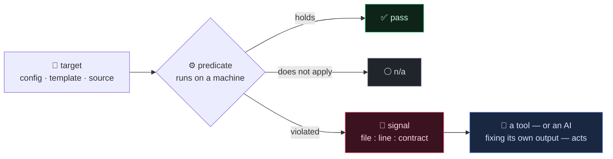
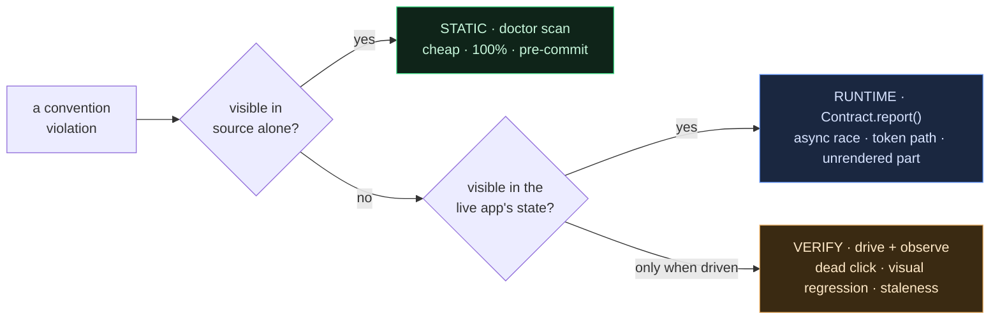
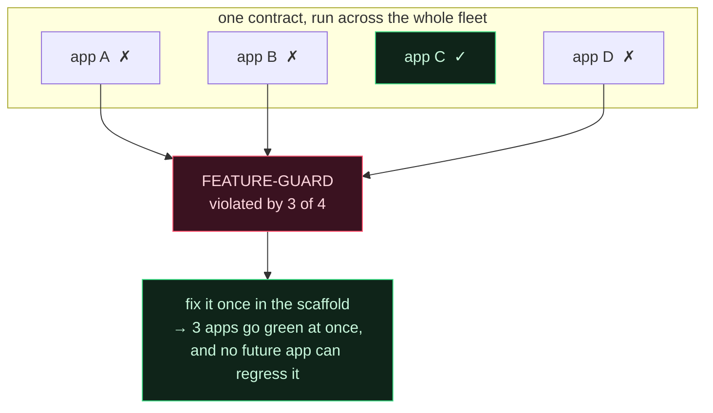
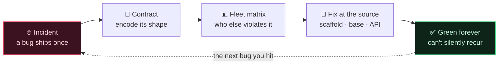
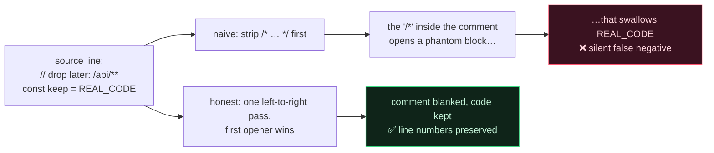

[🇺🇸 English](README.md) · [🇰🇷 한국어](README.ko.md)

# Contract-Driven Scaffolding

**You can't review every line an AI writes. So stop reviewing — make each project prove itself green against the bugs you've already been burned by.**

> Used by [**NSKit**](https://github.com/nskit-io/nskit-io) — *bound by structure, free to combine.* This is the self-diagnosis model behind NSKit's `doctor`, which gates a fleet of ~30 production apps largely authored by an LLM.

> A bug happens once. Then you write the check that makes its *shape* impossible — and run that check across everything you own, forever.

**Contract-Driven Scaffolding** is a design pattern — with a dependency-free reference implementation — for keeping generated code correct at scale. It is not a linter you install; it is a way of turning each incident into a machine-checked contract, and turning the *set* of those contracts into a ranked backlog of what to fix at the source. Port it into any stack.

---

## Table of Contents

- [The problem: a framework's worst bugs are its own](#the-problem-a-frameworks-worst-bugs-are-its-own)
- [Why the usual answers don't hold](#why-the-usual-answers-dont-hold)
- [A contract is four things](#a-contract-is-four-things)
- [The three tiers: static, runtime, verify](#the-three-tiers-static-runtime-verify)
- [The twist that makes it compound: the promotion matrix](#the-twist-that-makes-it-compound-the-promotion-matrix)
- [The hard part: naive grep lies](#the-hard-part-naive-grep-lies)
- [Reference code](#reference-code)
- [How this differs from ESLint / Semgrep / Checkstyle](#how-this-differs-from-eslint--semgrep--checkstyle)
- [When to use it — and when not to](#when-to-use-it--and-when-not-to)
- [Links](#links)

---

## The problem: a framework's worst bugs are its own

Give an LLM a codebase and it will write a lot of correct code and a little wrong code. The wrong code is rarely a dumb typo — a compiler catches those. It's the code that *looks* right and violates a convention only your project has:

- a full-screen dialog that dismisses on back-button on mobile — except the framework never wired back into its history, so back exits the whole app;
- a sub-page that scrolls everywhere — except one utility class sets `display:block`, quietly overriding the flex layout the scroll depends on;
- an admin page whose JavaScript is silently corrupted because a `[[ array ]]` literal collided with the template engine's `[[${…}]]` syntax — while the source passed every syntax check.

None of these are domain bugs. They are **the tax of your own abstractions** — every convention you invent is a convention someone (or some model) must forever remember to honor. Human review doesn't scale to the volume an AI produces, and a wiki page of "gotchas" is read once and forgotten. The knowledge lives in one person's head, and that person is the bus factor.

## Why the usual answers don't hold

**A "common mistakes" doc.** Real institutional memory — and inert. It cannot fail a build. Every new project re-earns the same bug because nothing *checks*.

**Human code review.** Correct, and it does not scale to the output of a model that writes a module a minute. Reviewers habituate; the tenth instance of a subtle convention slips through.

**Generic static analysis** (ESLint, Semgrep, Checkstyle). Excellent at *universal* anti-patterns. Blind to *yours* — no off-the-shelf rule knows that in your framework a `.show{display:block}` breaks a sub-page, because that fact only exists because you built it that way.

Every one of these recurring bugs reduces to a single sentence:

> **The framework trusts the builder to get it right, instead of guaranteeing it.**

A contract turns that trust into an automated check. When the "builder" is an AI, that trust is exactly the thing you cannot extend — so you encode it instead.

## A contract is four things

```
contract = (target, when-checked, predicate, violation-signal)
```

- **target** — what it inspects: a config file, a template, a properties file, a source tree.
- **when-checked** — the earliest tier it can be caught at (below).
- **predicate** — runs on a *machine*, never a human. It holds, is violated, or does not apply.
- **violation-signal** — machine-readable: `file:line:contract`. Another tool — or an AI fixing its own output — parses it and acts. A human-readable report is a courtesy layered on top.



The discipline is: **you do not add a primitive to the framework without the contract that proves it.** The contract *is* the self-diagnosis.

## The three tiers: static, runtime, verify

Catch each bug at the earliest, cheapest tier it can be caught at.



The same four-part shape at every tier — only the cost and the moment change:

```
STATIC  (build / lint)         RUNTIME (self-report)          VERIFY  (closed-loop)
source alone decides           the live app asserts its       drive the change, observe
                               own state                       real behavior
= doctor scan                  = Contract.report()            = playwright / probes
cheap · 100% · pre-commit      medium · "why didn't it draw"   costly · catches dead clicks,
                                                                visual regressions, staleness
```

Most drift and debt dies in the **static** tier — this repo's reference implementation. The runtime and verify tiers exist for the bugs source can't see (an async race, a token refresh path, a dead click), and share the same shape: machine predicate, machine-readable signal.

## The twist that makes it compound: the promotion matrix

A gate that only says pass/fail on one project is a linter. Run the *same* contracts across your whole fleet and something better falls out:

```
━━ doctor MATRIX (2 projects) ━━
  PROJECT          NO-DEBUG-  INLINE-AR  USEAUTH-D  LOCALE-PA  FEATURE-G
  green_app                ✓          ✓          ✓          ✓          ✓   green
  red_app                  ✗          ✗          ✗          ✗          ✗   5 fail

  Promotion backlog — fix these at the source, widest blast radius first:
    FEATURE-GUARD          7 projects: aweb, mall, plaza, wallet, …
    LOCALE-PARITY          3 projects: …
```

The contract violated by the **most** projects is the abstraction most worth fixing *at the source* — in the scaffold, the base template, the framework API — so it can never recur. The matrix is a **promotion backlog ranked by blast radius**, and it falls straight out of the same checks that gate each project. Your linter now tells you which of your own conventions to fix next. No generic tool can do this, because no generic tool knows the convention was yours.



This is the flywheel — each turn makes the next project harder to break:



## The hard part: naive grep lies

A contract linter is only as trustworthy as its willingness to *not* fire on look-alikes. The moment it cries wolf, people stop reading it, and a gate nobody trusts is worse than no gate. Three lessons, each learned the expensive way, are baked into the reference engine:

**1. Comments are not code.** A forbidden token in a comment is not a violation. But blank block comments before line comments and you get a phantom bug: a line like `// drop later: /api/**` contains the substring `/*`, which opens a block comment that eats every real line until the next `*/`. The fix is a single left-to-right alternation — whichever comment opens first wins — exactly as the language lexer sees it. (`blank_comments` in [`core.py`](src/contracts/core.py).)



**2. The same characters mean different things in different places.** `[[${user}]]` inside a template is a legitimate server expression; `[[ 'a', 1 ], …]` is a JavaScript array-of-arrays that the template engine will silently mangle. The contract must fire on the second and never the first.

**3. Context lives on the neighbouring line.** `useAuth: false` is an abuse — *unless* the call two lines down is the token-issuing endpoint that's allowed to skip auth. In a real object literal those sit on different lines, so a single-line grep flags the exception and misses the abuse. The engine offers a `±N line window` so the predicate can see the context that decides it.

These are why the pattern is more than "some regexes." Getting them right is the difference between a gate people trust and one they mute.

## Reference code

Dependency-free Python in [`src/`](src/) — a ~200-line engine plus a starter library of contracts, each distilled from a real field incident. A contract is a small function over a `Project`:

```python
from src.contracts import contract, Project, Result, Severity, verdict

@contract(id="NO-DEBUG-MARKER", section="incident-log#debug-markers",
          severity=Severity.MED,
          describe="No DEBUG_ONLY marker survives into shipped source")
def no_debug_marker(p: Project) -> Result:
    hits = p.grep(r"\bDEBUG_ONLY\b", exts=(".js", ".java", ".py"))  # comments auto-skipped
    return verdict(hits, "no live DEBUG_ONLY markers",
                   "DEBUG_ONLY in shipped source ({n})")
```

Run the worked example — two fixture projects, one green, one that trips five contracts, then the fleet matrix and promotion backlog:

```bash
python examples/demo.py
python -m pytest test/          # the "naive grep lies" cases, asserted as tests
```

Scan and gate any project (JSON is the machine contract; the pretty report is a courtesy):

```bash
python -m src.doctor scan   ./my-project --json
python -m src.doctor matrix ./all-my-projects
```

## How this differs from ESLint / Semgrep / Checkstyle

Those are the right tools for *universal* rules, and you should use them. This pattern is orthogonal, on three axes:

- **It targets your abstractions, not the language's.** The contracts encode bugs that exist only because *your* framework works the way it does. There is no community ruleset for "this project's conventions."
- **The matrix is a first-class output.** The goal is not only to gate a project but to rank *your own* debt by blast radius, and drive fixes into the scaffold. It is a framework-evolution instrument, not just a gate.
- **Contracts span tiers.** Some things source can't see (an async render race, a history imbalance) belong in the runtime/verify tiers, under the same four-part shape. It's a model for correctness across the whole lifecycle, not a lint stage.

If a rule is universal, reach for Semgrep. If a rule exists because *you* built something a certain way, it's a contract.

## When to use it — and when not to

- **Use it when** a lot of your code is generated (by an AI, a scaffold, or a codegen step) and your framework has conventions that generic linters can't know — especially across more than one project, where the matrix earns its keep.
- **Use it when** the same class of bug has bitten you twice. The second time is the signal to write the contract instead of the fix.
- **Skip it when** you have one small app and a reviewer who sees every line. The overhead of formalizing contracts only pays back at fleet scale or generation volume.
- **Don't over-fit.** A contract that fires on look-alikes trains people to ignore it. If you can't make it honest (see [the hard part](#the-hard-part-naive-grep-lies)), leave it in the "common mistakes" doc until you can.

## Links

- [**NSKit**](https://github.com/nskit-io/nskit-io) — the framework this pattern runs inside
- [**ai-native-design**](https://github.com/nskit-io/ai-native-design) — the design philosophy behind building for an AI author
- Built by [Neoulsoft Inc.](https://neoulsoft.com) — Seoul, est. 2019

## License

MIT © Neoulsoft Inc. See [LICENSE](LICENSE).
