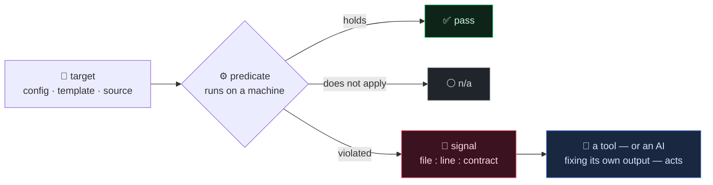
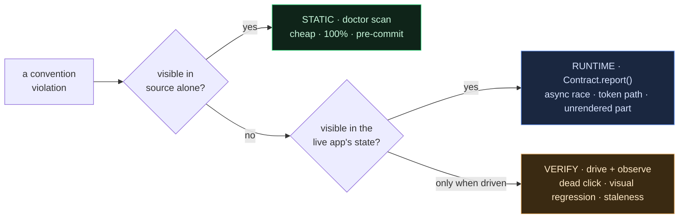
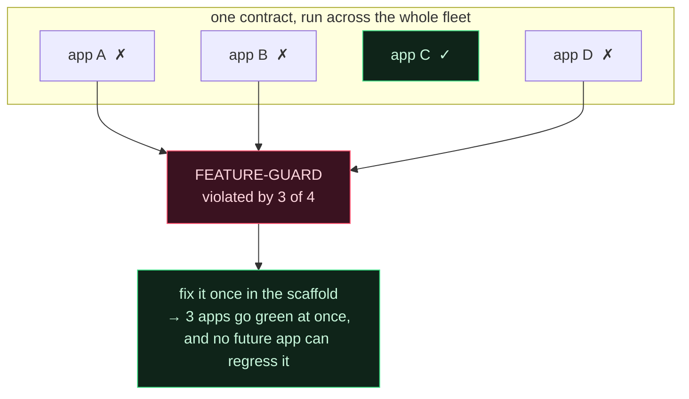
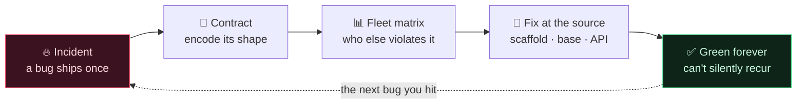
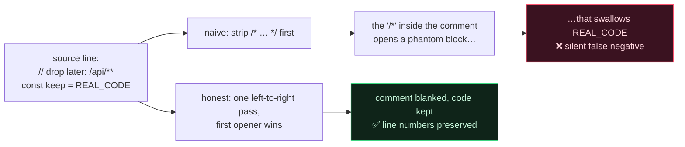

[🇺🇸 English](README.md) · [🇰🇷 한국어](README.ko.md) · [🇯🇵 日本語](README.ja.md) · [🇨🇳 简体中文](README.zh.md)

# Contract-Driven Scaffolding

**你没法逐行审查 AI 写出的每一行代码。那就别再审查——让每个项目在你已经栽过跟头的那些 bug 面前，自己证明自己是 green 的。**

> [**NSKit**](https://github.com/nskit-io/nskit-io) 正在使用 — *受结构约束，组合自由。* 这是 NSKit `doctor` 背后的自诊断模型，用它为约 30 个大部分由 LLM 编写的生产应用把关。

> bug 只发生一次。接下来要做的不是去修，而是写一条检查，让这个 bug 的*形态*再也无法成立——然后在你拥有的每一个项目上永远跑下去。

**Contract-Driven Scaffolding** 是一种设计模式，用来在规模变大后仍让生成的代码保持正确，并附带一份零依赖的参考实现。它不是一个装来就用的 linter，而是一种思路：**把遇到的每一次事故变成一条由机器检查的契约，再把这些契约的*集合*变成「先在源头修哪里」的优先级清单。** 可以原样移植到任何技术栈。

---

## 目录

- [问题 — 框架最糟糕的 bug 是框架自己造的](#问题--框架最糟糕的-bug-是框架自己造的)
- [常见的对策为什么不管用](#常见的对策为什么不管用)
- [契约由四部分组成](#契约由四部分组成)
- [3-tier — static · runtime · verify](#3-tier--static--runtime--verify)
- [让它产生复利的转折 — 晋级矩阵](#让它产生复利的转折--晋级矩阵)
- [真正难的地方 — 朴素的 grep 会说谎](#真正难的地方--朴素的-grep-会说谎)
- [参考代码](#参考代码)
- [与 ESLint · Semgrep · Checkstyle 有何不同](#与-eslint--semgrep--checkstyle-有何不同)
- [何时用，何时不要用](#何时用何时不要用)
- [链接](#链接)

---

## 问题 — 框架最糟糕的 bug 是框架自己造的

把一个代码库交给 LLM，它会写出大量正确的代码，和少量错误的代码。可这些错误并不是拼写错误——那种编译器会替你抓住。真正棘手的，是那些*看上去没问题*、却违反了只有你这个项目才有的约定的代码。

- 想用返回键关闭移动端的全屏对话框，可框架从来没把返回接进历史栈，于是一按返回就整个退出了应用。
- 子页面理应可以滚动，却被某个工具类加上 `display:block`，悄悄盖掉了滚动所依赖的 flex 布局。
- 后台页面的 JavaScript 悄无声息地坏了：`[[ 数组 ]]` 字面量和模板引擎的 `[[${…}]]` 语法撞车，而源码却能顺利通过语法检查。

这三者没有一个是业务 bug。它们全是**你自己造的抽象向你收的税**。你每定一条约定，它就成了某个人——或某个模型——必须永远记住并遵守的约定。人工审查追不上 AI 产出的量，「常见错误」的 wiki 只被读一次就被忘掉。到头来这些知识只留在一个人的脑子里，而那个人就是巴士因子。

## 常见的对策为什么不管用

**「常见错误」文档。** 是很好的组织记忆，却是死的。它拦不下一次构建。因为它什么都不*检查*，每开一个新项目，你都得把同一个 bug 从头重新踩一遍。

**人工代码审查。** 没错，可它追不上一分钟吐一个模块的模型。审查者会习惯，某条微妙约定的第十次违规就这么放过去了。

**通用静态分析**（ESLint、Semgrep、Checkstyle）。对*普适*的反模式很在行，却对*你的*那套视而不见。没有哪条现成规则会知道，在你的框架里 `.show{display:block}` 会把子页面弄坏——因为那是你亲手造出来才有的事实。

这些反复出现的 bug，最终都能压缩成一句话：

> **框架不去保证契约，而是指望构建者自己写对。**

契约把这份「指望」变成自动检查。而当构建者变成 AI 的那一刻，这份信任恰恰是你无论如何都给不出去的——所以别再指望，把它写进代码里。

## 契约由四部分组成

```
契约 = (对象, 检查时机, 判定式, 违规信号)
```

- **对象** — 检查什么：config、模板、properties、源码树。
- **检查时机** — 能最早抓住它的那一层（见下）。
- **判定式** — 由*机器*来跑，而不是人来审。成立 / 违规 / 不适用，三者之一。
- **违规信号** — 必须机器可读，形如 `file:line:contract`。另一个工具、或一个正在修正自己输出的 AI，会解析它并立刻行动。给人看的报告只是加在上面的一层顺手之举。



纪律只有一条：**没有能证明它的契约，就不往框架里加新的原语。** 契约本身就是自诊断。

## 3-tier — static · runtime · verify

每个 bug，都在能抓住它的层级里，选最早、最便宜的那一层抓。



层级不同，契约的形态还是同样那四部分，变的只是成本和时机。

```
STATIC (构建/lint)         RUNTIME (自报状态)              VERIFY (闭环)
只看源码即可判定            应用活着时自己 assert            改动后真正跑起来观察
= doctor scan             = Contract.report()            = playwright / probes
便宜·100%·预提交            居中·「为什么没渲染出来」          昂贵·死点击·视觉回归·数据新鲜度
```

债务与漂移大多死在 **static** 层——本 repo 的参考实现就是这一层。runtime、verify 两层是为源码看不见的 bug（async 竞态、token refresh 路径、没渲染出来的 part、死点击）而存在，形态一样：机器判定式，机器可读信号。

## 让它产生复利的转折 — 晋级矩阵

只对一个项目给出 pass/fail，那就只是个 linter。可一旦把*同一批*契约跑遍整个 fleet，会掉出更值钱的东西。



被*最多*项目违反的那条契约，恰恰是**最值得在源头修的抽象**。在脚手架里、在 base 模板里、在框架 API 里改掉，它就再也不会复发。矩阵是一份**按爆炸半径排序的晋级清单**，而它就从为每个项目把关的那同一批检查里直接掉出来。如今 linter 连「你自己定的约定里，下一个该修哪条」都替你指了出来。通用工具做不到这一点——因为它根本不知道那条约定原本就是你的。



这就是飞轮。**事故 → 契约 → fleet 矩阵 → 在源头修 → 永远 green。** 每转一圈，下一个项目就更难被弄坏一点。每一个让你栽过跟头的 bug，都让未来所有项目更结实一分。

## 真正难的地方 — 朴素的 grep 会说谎

一个契约 linter，值不值得信，全看它对 look-alike*不去误报*的克制。只要当过一次狼来了，人们就不再看它；而一个没人信的关卡，还不如没有。有三条用高昂学费换来的教训，被刻进了参考引擎里。

**1. 注释不是代码。** 注释里的禁用 token 不算违规。可要是把块注释排在行注释前面先 blank 掉，就会冒出一个幽灵 bug：像 `// 稍后删除: /api/**` 这样一行里藏着 `/*` 这个子串，会开启一个块注释，把真正的代码一路吞到下一个 `*/`。解法是单趟从左到右的 alternation——先开的注释先赢——正如语言的 lexer 所见。（见 [`core.py`](src/contracts/core.py) 里的 `blank_comments`。）



**2. 同样的字符，位置不同意思就不同。** 模板里的 `[[${user}]]` 是合法的服务端表达式，而 `[[ 'a', 1 ], … ]` 则是会被模板引擎悄悄搅坏的 JavaScript 二维数组。契约必须对后者发火，对前者绝不发火。

**3. 上下文在邻行。** `useAuth: false` 是滥用——*除非*下面两行的调用，是允许跳过鉴权的发 token 端点。在真实的对象字面量里，这两者落在不同的行上，所以只看单行的 grep 要么误报那个例外，要么漏掉真正的滥用。引擎提供了 `±N 行的窗口`，让判定式能看到决定成败的上下文。

所以这套模式远不止「几条正则」。能不能把它做对，正是「人愿意信的关卡」和「被静音的关卡」之间的分水岭。

## 参考代码

[`src/`](src/) 里是零依赖的 Python——约 200 行的引擎，加上一套起步契约库，每条都从真实的现场事故里蒸馏而来。一条契约，不过是一个接收 `Project` 的小函数。

```python
from src.contracts import contract, Project, Result, Severity, verdict

@contract(id="NO-DEBUG-MARKER", section="incident-log#debug-markers",
          severity=Severity.MED,
          describe="No DEBUG_ONLY marker survives into shipped source")
def no_debug_marker(p: Project) -> Result:
    hits = p.grep(r"\bDEBUG_ONLY\b", exts=(".js", ".java", ".py"))  # 注释自动排除
    return verdict(hits, "no live DEBUG_ONLY markers",
                   "DEBUG_ONLY in shipped source ({n})")
```

跑一遍 worked example —— 两个 fixture 项目（一个 green，一个故意踩中 5 条契约），外加 fleet 矩阵和晋级清单：

```bash
python examples/demo.py
python -m pytest test/          # 「朴素的 grep 会说谎」那些 case 都被写成了测试
```

扫描并把关任意项目（JSON 是给机器的契约，好看的报告只是顺带）：

```bash
python -m src.doctor scan   ./my-project --json
python -m src.doctor matrix ./all-my-projects
```

## 与 ESLint · Semgrep · Checkstyle 有何不同

那些是给*普适*规则用的好工具，你当然该用。这套模式在三个维度上与它们正交。

- **瞄准的是你的抽象，而非语言。** 契约装的是那种「因为*你的*框架就这么运作」才会出现的 bug。没有哪个社区规则集，是针对「本项目专属约定」的。
- **矩阵是一等产物。** 目的不止于给项目把关，而是把*你的*技术债按爆炸半径排好队，把修复推回脚手架。它不是一道 lint 工序，而是推动框架进化的契机。
- **契约横跨各层。** 源码看不见的东西（async 渲染竞态、历史栈失衡），以同样的四部分形态落在 runtime、verify 层。它不是 lint 的某一步，而是贯穿整个生命周期的一致性模型。

规则若是普适的，就上 Semgrep。规则若是*因为你*把某样东西造成了特定的样子才存在，那它就是契约。

## 何时用，何时不要用

- **该用** —— 当你相当一部分代码是生成的（无论是 AI、脚手架还是 codegen），而框架里有着通用 linter 不可能知道的约定时。尤其在矩阵能大显身手的多项目环境里。
- **该用** —— 当同一类 bug 已经坑了你两次。第二次，就是「别去修，去写契约」的信号。
- **别用** —— 当只有一个小应用，而且有位审查者会看过每一行时。把契约形式化的开销，只有在 fleet 规模或生成量下才回得了本。
- **别过拟合。** 一条会对 look-alike 发火的契约，会把人训练成「无视它」。做不到诚实就先别做（见[真正难的地方](#真正难的地方--朴素的-grep-会说谎)），留在「常见错误」文档里，直到你能把它做对为止。

## 链接

- [**NSKit**](https://github.com/nskit-io/nskit-io) —— 这套模式真正在运行的框架
- [**ai-native-design**](https://github.com/nskit-io/ai-native-design) —— 「为 AI 作者而设计」的理念
- 由 [Neoulsoft Inc.](https://neoulsoft.com) 打造 —— 首尔，成立于 2019 年

## 许可证

MIT © Neoulsoft Inc. 见 [LICENSE](LICENSE)。
